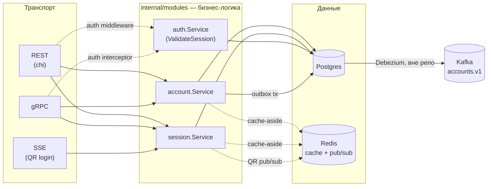
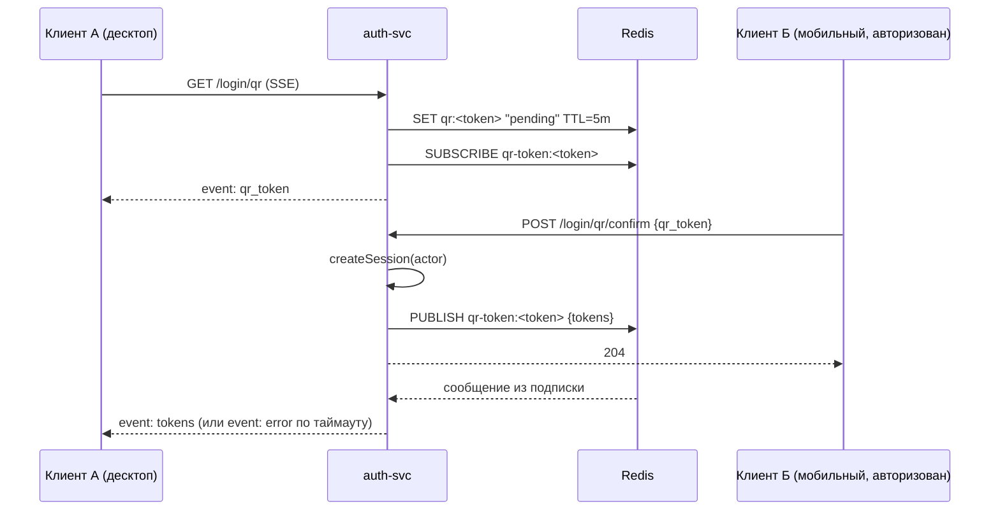

# Архитектура auth-svc

Этот файл — живая карта проекта. Обновляем его при значимых архитектурных изменениях
(новый модуль, смена транспорта, новый внешний интерфейс), а не при каждом мелком фиксе.

## Что это

`auth-svc` — сервис аутентификации/авторизации в микросервисной экосистеме **netbill**.
Владеет аккаунтами, email/паролями, сессиями и логином (email, Google OAuth, QR).
Отдаёт наружу REST, gRPC и SSE. Публикует доменные события в Kafka через transactional
outbox (Postgres → Debezium), сам Kafka не трогает напрямую.

## Стек

- **Go 1.25**, чистая слоистая архитектура без DI-фреймворков — сборка руками в
  `internal/build/app/run.go`.
- **Postgres** (`jackc/pgx`) — основное хранилище, `wal_level=logical` под Debezium.
- **Redis** (`redis-stack-server`, модуль **RedisJSON**) — кэш чтения + pub/sub для QR-логина.
- **gRPC** + **REST** (chi) — два независимых транспорта поверх одной бизнес-логики.
- **SSE** (Server-Sent Events) — потоковый REST-эндпоинт для QR-логина.
- **OpenTelemetry** (traces + metrics) + **Prometheus** — observability.
- **JWT** (`golang-jwt/jwt/v5`) — access/refresh токены, отдельные секреты.
- Общие библиотеки экосистемы: `netbill/restkit` (JSON:API-рендеринг, problems, SSE-хелперы,
  пагинация, токен-клеймы), `netbill/evtypes` (типы событий для Kafka), `netbill/ape`
  (декларативные ошибки), `netbill/pgdbx`, `netbill/logium`.

## Структура репозитория

```
cmd/auth-svc/            entrypoint (main.go → internal/build/cli)

internal/
  build/
    cli/                 разбор аргументов (kingpin): run service | migrate up|down
    app/                 App.Run — вся композиция зависимостей, App.MigrateUp/Down
    config/              LoadConfig() — конфиг целиком из env-переменных, без YAML

  api/
    rest/                chi-роутер, контроллеры, request/response мапперы, middleware
      controller/           SessionController (login/QR/sessions), AccountController
      requests/, responses/ парсинг запросов и сборка oapi.*-моделей (JSON:API)
      middlewares/          AccountAuth (JWT), CORS, Logger
      scope/                контекст запроса (логгер, актор из JWT)
    grpc/                 gRPC-сервер, интерцепторы, контроллеры (свой набор, не REST!)
      controller/           AccountServer, SessionServer, AuthServer
      interceptors/         Log, Auth
      scope/, reponses/     аналоги REST-scope/responses для gRPC

  modules/               бизнес-логика, транспорт-агностична
    account/                 регистрация, профиль, смена пароля, удаление
    session/                 логин (email/google/qr), сессии, refresh, QR-токены
    auth/                    ValidateSession — общий для REST и gRPC гейт авторизации

  repo/
    pg/                   Postgres-репозитории + OutboxRepo (transactional outbox)
    chache/                кэш-обёртки над Redis (cache-aside), "chache" — опечатка в
                           имени пакета, так исторически сложилось

  bus/                   Redis pub/sub обёртка (только для QR-логина, не для outbox)
  errx/                  декларативные доменные ошибки (via netbill/ape)
  models/                доменные модели (Account, Session, TokensPair, ...)
  observability/         metrics/ (Prometheus), telemetry/ (OTel init)

pkg/                     переиспользуемые, не завязанные на internal-домен пакеты
  tokenmanager/          генерация/парсинг JWT access+refresh
  passmanager/            bcrypt
  googleid/               локальная проверка Google ID-token по JWKS (для gRPC-логина)
  oapi/                   generated — Go-типы из OpenAPI-схемы (не редактировать руками)
  pb/                     generated — protobuf/gRPC (не редактировать руками)
  log/                    структурный логгер

migrations/schema/       SQL-миграции (rubenv/sql-migrate)
proto/                   .proto источники для pkg/pb
docs/
  rest/                   OpenAPI-спека (docs/rest/api.yaml + spec/**), Swagger UI
  grpc/                   сгенерированная HTML-дока по proto
  architecture.md         этот файл
tests/                  unit-тесты лежат рядом с кодом (*_test.go); тут — интеграционные:
  cache_test/, repo_test/, modules_test/, rest_test/   гоняются на реальных Postgres/Redis
  testutil/                                             хелперы + test_config.yaml для них
deployment/
  Dockerfile, docker-compose.yml, .dockerignore
```

## Слои и поток запроса



Важно: у REST и gRPC **разные** контроллеры (`internal/api/rest/controller` и
`internal/api/grpc/controller`), но один и тот же слой `internal/modules/*` под ними —
дублируется только транспортная обвязка (парсинг запроса, коды ошибок), не бизнес-логика.

## Транспорты

- **REST** — `internal/api/rest/server.go`, роуты под `/auth-svc/v1/...`. Ответы —
  JSON:API-конверт (`{"data": {...}}` / `{"errors": [...]}`) через `netbill/restkit/render`.
  OpenAPI-спека — `docs/rest/api.yaml` (+ `spec/**`), генерация Go-типов в `pkg/oapi` —
  `make bundle-oapi` (нужны `swagger-cli`, `java` + `~/openapi-generator-cli.jar`).
- **gRPC** — `internal/api/grpc/server.go`, схемы — `proto/*.proto`, генерация —
  `make proto`. HTML-дока — `make proto-doc` → `docs/grpc`.
- **SSE** — не отдельный транспорт, а один REST-эндпоинт (`GET /login/qr`) с
  `Content-Type: text/event-stream` вместо обычного JSON-ответа. См. ниже.

## Ключевые механизмы

### QR-логин (SSE + Redis pub/sub)



Зачем pub/sub, а не просто in-memory channel: `QRConnect` и `QRConfirm` — два независимых
HTTP-запроса, которые при горизонтальном масштабировании могут попасть на разные реплики
`auth-svc`. Redis — единственный мост между ними.

TTL QR-токена — один источник правды, `session.QRTokenTTL` (`internal/modules/session/login.go`),
используется и как TTL в Redis, и как write-deadline SSE-соединения (`http.ResponseController`,
т.к. глобальный `http.Server.WriteTimeout` слишком короткий для 5-минутного стрима).

### Transactional outbox → Kafka

`internal/repo/pg/outbox.go` пишет в таблицу `outbox_events` **в той же транзакции**, что
и сама бизнес-операция (см. `account.Service.Registration`) — исключает рассинхрон
"аккаунт создан, событие потеряно". Дальше по плану — Debezium читает WAL (поэтому у
Postgres `wal_level=logical`) и публикует в Kafka. **В этом репозитории Debezium/Kafka не
подняты** — `outbox_events` копится, но никуда не уезжает, пока эта инфраструктура не
развёрнута отдельно. `auth-svc` сам ни продюсер, ни консьюмер Kafka-клиента — только
пишет в outbox-таблицу.

### Кэш (Redis, cache-aside)

`internal/repo/chache/*`. Паттерн одинаковый везде: `Get` из кэша → любая ошибка (включая
реальный сбой Redis, не только промах) → идём в Postgres → асинхронно (`go cache.Set(...)`,
`context.WithoutCancel`) прогреваем кэш. Запись/апдейт — не инвалидация, а сразу
перезапись свежим значением. Удаление — явный `Delete` по всем связанным ключам.

**Важно:** `auth.Service.ValidateSession` (дергается на каждый авторизованный запрос,
и REST, и gRPC) кэш **не использует**, всегда идёт в Postgres напрямую — осознанно, чтобы
отозванная сессия/удалённый аккаунт не проходили авторизацию ещё до 5 минут по стухшему кэшу.

### Аутентификация

- Пароли — bcrypt (`pkg/passmanager`), cost конфигурируется.
- JWT access/refresh — `pkg/tokenmanager`, отдельные secret/hash ключи под access и refresh.
- Google OAuth:
  - **REST** — полный authorization-code flow (`LoginByGoogleOAuth`/`...Callback` в
    `internal/api/rest/controller/login.go`): редирект → обмен кода → запрос userinfo.
  - **gRPC** — принимает готовый Google ID-token, проверяет его **локально** по JWKS
    Google (`pkg/googleid`, без похода на tokeninfo-эндпоинт), а не через тот же
    authorization-code flow — два разных механизма для одного и того же логина, потому
    что у транспортов разные исходные данные от клиента.

### Конфигурация

Только env-переменные, никакого YAML-файла (см. `internal/build/config/config.go`).
Обязательные (паника при отсутствии): `DATABASE_SQL_URL`, `REDIS_ADDR`,
`AUTH_TOKENS_ACCOUNT_ACCESS_SECRET_KEY`, `AUTH_TOKENS_ACCOUNT_REFRESH_SECRET_KEY`,
`AUTH_TOKENS_ACCOUNT_REFRESH_HASH_KEY`. Всё остальное — опционально, дефолты и полный
список — в `.env.example`.

## Известные пробелы (актуально на момент написания)

- **Email verification не реализован.** Поле `verified` есть в схеме/моделях/ответах API,
  но нигде не выставляется в `true` — ни отправки письма, ни эндпоинта подтверждения.
- **Debezium/Kafka не подняты** ни в `deployment/docker-compose.yml`, ни где-либо ещё в
  репозитории — outbox работает "в один конец в никуда" локально.
- **`Kafka.Brokers` в конфиге не используется** нигде в коде — мёртвое поле, задел на
  будущее (если понадобится прямой consumer).
- **Нет rate limiting** на login-эндпоинтах.
- CORS в REST захардкожен под `localhost` (`internal/api/rest/middlewares/cors.go`).

## Как поднять локально

```
cp .env.example .env      # заполнить секреты
make docker-up             # postgres + redis + auth-svc + swagger-ui + grpc-doc
# или без докера:
make migrate-up
make run-server
```

Регенерация доки/типов после правок API:
```
make bundle-oapi   # OpenAPI spec → docs/rest/api-bundled.yaml + pkg/oapi (нужны java, swagger-cli)
make proto         # .proto → pkg/pb
make proto-doc     # .proto → docs/grpc (HTML)
```
